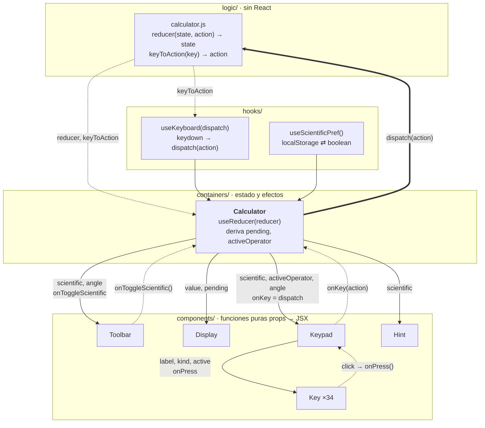

# Calculadora

Calculadora web en React con modo científico y estilo Super Mario Bros.

## 🚀 Pruébala en vivo

**https://gsalgadotoledo.github.io/calculadora/**


## Qué hace

- **Básico:** dígitos, `.`, `+ − × ÷`, `=`, `C`, retroceso, `±`, `%`.
- **Científico** (botón «Científica», se recuerda entre visitas): `sin cos tan` en grados o radianes, `ln log`, `√`, `x²`, `xʸ`, `1/x`, `x!`, `eˣ`, `10ˣ`, `π`, `e`.
- **Teclado:** números y operadores, `Enter` `=`, `Backspace`, `Esc` limpia; en científico además `^` `!` `r` (√) `p` (π).
- **Sin basura de punto flotante:** `0.1 + 0.2 = 0.3`, `sin(π rad) = 0`.
- Encadena por la izquierda, como una calculadora de bolsillo: `2 + 3 × 4 = 20`.

## Correr en local

```sh
npm install
npm run dev        # http://localhost:5173
npm test           # 20 tests del reducer (node --test)
npm run lint       # oxlint
npm run build      # dist/, ~71 kB gzip
```

Stack: React 19 + Vite 8. Sin más dependencias en producción.

## Cómo está organizado el código

```
src/
├── main.jsx                  monta <App/> en #root
├── App.jsx                   layout (cielo, suelo) y <Calculator/>
├── logic/
│   ├── calculator.js         reducer puro: TODA la aritmética, sin React
│   └── calculator.test.js    20 tests sobre el reducer
├── hooks/
│   ├── useKeyboard.js        teclas físicas → acciones del reducer
│   └── useScientificPref.js  modo científico persistido en localStorage
├── containers/
│   └── Calculator.jsx        el ÚNICO componente con estado y efectos
├── components/               componentes funcionales presentacionales
│   ├── Toolbar.jsx           botón «Científica» + indicador DEG/RAD
│   ├── Display.jsx           operación pendiente + número actual
│   ├── Keypad.jsx            rejillas básica y científica
│   ├── Key.jsx               una tecla
│   ├── Hint.jsx              ayuda de teclado
│   └── buttons.js            configuración de las teclas (datos, no código)
└── styles/
    ├── index.css             fuente pixel, cielo NES, nubes, suelo
    └── calculator.css        panel de ladrillos, bloques «?», tubería
```

### Patrón: container + componentes presentacionales

Todos los componentes son **funciones** (no hay clases). Se dividen en dos clases de responsabilidad:

| | Container (`containers/Calculator.jsx`) | Presentacionales (`components/*`) |
|---|---|---|
| Estado (`useReducer`, `useState`) | ✅ el único que lo tiene | ❌ ninguno |
| Efectos (teclado, localStorage) | ✅ vía hooks | ❌ ninguno |
| Sabe qué hace una tecla | ✅ despacha acciones al reducer | ❌ sólo avisa `onKey(action)` |
| Entrada | nada | **props** |
| Salida | los componentes con sus props | **JSX** |

Un componente presentacional es una función pura `props → JSX`: dado el mismo input pinta lo mismo, no toca el mundo exterior y se puede leer sin saber nada del resto. Toda la decisión de *qué* mostrar está en un solo sitio, el container, que a su vez no calcula nada: delega la aritmética al reducer de `logic/`.



Líneas continuas: **props hacia abajo**. Punteadas: **callbacks hacia arriba**. La gruesa: el container despacha al reducer y React vuelve a pintar con el estado nuevo.

## Cómo funciona

### 1. El estado es un objeto y la lógica un reducer

`logic/calculator.js` no importa React. Exporta `reducer(state, action)`: recibe el estado actual y una acción (`{ type: 'digit', value: '7' }`, `{ type: 'operator', value: '×' }`, `{ type: 'equals' }`, `{ type: 'unary', value: 'sin' }`…) y devuelve un estado nuevo. Nunca muta el anterior.

```js
{
  display: '56',            // lo que se ve, ya redondeado a 12 cifras
  value: 56,                // el número exacto detrás del display (null si lo tecleó el usuario)
  accumulator: null,        // operando izquierdo pendiente
  operator: null,           // '+' | '-' | '×' | '÷' | '^'
  waitingForOperand: false, // tras un operador o '=': la próxima cifra empieza número nuevo
  lastOperand: null,        // para repetir '=' (2 + 3 = = → 8)
  lastOperator: null,
  angle: 'deg',             // 'deg' | 'rad', sobrevive a C y =
}
```

Como es una función pura, los 20 tests la ejercitan sin navegador ni React: `reducer(reducer(reducer(s, digit 7), operator ×), digit 8)` y se comprueba `display`.

**Por qué `value` además de `display`:** `display` es texto redondeado; `value` es el número real. Así `sin(π)` en radianes da `0` y no `1.22e-16`, y `0.1 + 0.2` muestra `0.3` sin arrastrar el error a la siguiente operación.

### 2. El container conecta el reducer con la UI

`containers/Calculator.jsx` hace exactamente cuatro cosas:

1. `useReducer(reducer, initialState)` → tiene `state` y `dispatch`.
2. `useScientificPref()` → sabe si el modo científico está activo y lo persiste.
3. `useKeyboard(dispatch)` → escucha `keydown` en `window`, lo pasa por `keyToAction` y despacha.
4. Deriva dos valores que la UI necesita pero el estado no guarda (`pending` = «7 ×», `activeOperator` = qué operador resaltar) y reparte todo como props.

### 3. Los componentes sólo pintan

`Keypad` recibe `onKey` y se lo pasa a cada `Key` como `onPress={() => onKey(b.action)}`. `Key` no sabe si es un dígito o un seno: recibe `label`, `kind` (para el color), `active` y `onPress`. Cuando el usuario pulsa, el callback sube hasta el container, éste hace `dispatch(action)`, el reducer calcula el estado nuevo y React vuelve a pintar de arriba abajo con las props nuevas.

Ratón y teclado terminan en el mismo `dispatch`: un clic en «×» y pulsar `*` producen la misma acción `{ type: 'operator', value: '×' }`.

### 4. La configuración de las teclas es un array

`components/buttons.js` describe cada tecla como datos: `{ label: '7', action: { type: 'digit', value: '7' } }`. Añadir una tecla científica es añadir una línea ahí y un caso en `applyUnary` del reducer; ni `Keypad` ni `Key` cambian.

## Publicar

`npm run deploy` construye con `VITE_BASE=/calculadora/` y sube `dist/` a la rama `gh-pages`. Alternativas y detalles en [DEPLOY.md](DEPLOY.md).

El GIF de arriba se genera con Chrome real desde `experiments/calc-smoke/demo-gif.mjs` (playwright-core + ffmpeg) en la sesión de trabajo, no forma parte de este repo.
