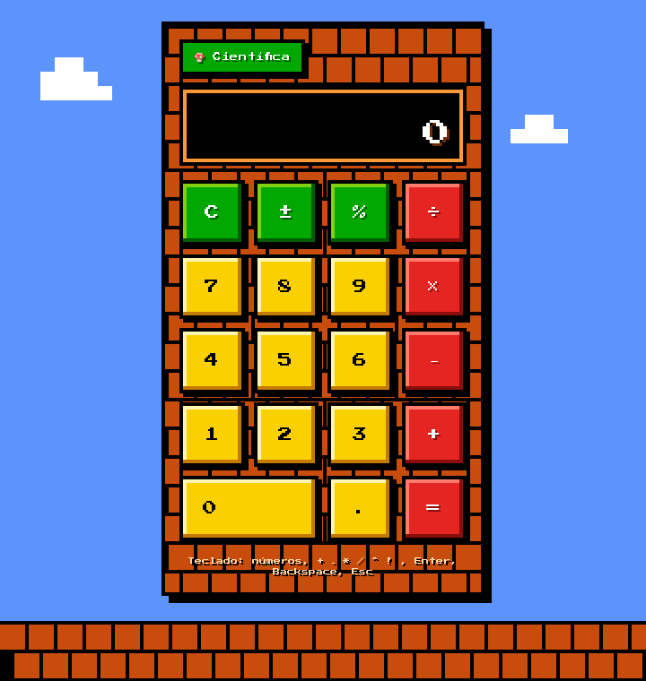

# Calculadora

Calculadora web en React con modo científico y estilo Super Mario Bros.

**Pruébala:** https://gsalgadotoledo.github.io/calculadora/



## Qué hace

- **Básico:** dígitos, `.`, `+ − × ÷`, `=`, `C`, retroceso, `±`, `%`.
- **Científico** (botón «Científica», se recuerda entre visitas): `sin cos tan` en grados o radianes, `ln log`, `√`, `x²`, `xʸ`, `1/x`, `x!`, `eˣ`, `10ˣ`, `π`, `e`.
- **Teclado:** números y operadores, `Enter` `=`, `Backspace`, `Esc` limpia; en científico además `^` `!` `r` (√) `p` (π).
- **Sin basura de punto flotante:** `0.1 + 0.2 = 0.3`, `sin(π rad) = 0`. El estado guarda el número exacto y el display lo redondea a 12 cifras.
- Encadena por la izquierda, como una calculadora de bolsillo: `2 + 3 × 4 = 20`.

## Correr en local

```sh
npm install
npm run dev        # http://localhost:5173
npm test           # 20 tests del reducer (node --test)
npm run lint       # oxlint
npm run build      # dist/, ~71 kB gzip
```

## Cómo está hecho

- `src/calculator.js` — la lógica entera es un reducer puro `(state, action) → state`, sin React. Es lo que prueban los tests.
- `src/Calculator.jsx` — la UI: pinta el estado, traduce clics y teclas a acciones.
- `src/Calculator.css`, `src/index.css` — el estilo Mario, solo CSS: fuente Press Start 2P, bloques «?» para dígitos, tubería para funciones, ladrillos, cielo NES con nubes y suelo.

Stack: React 19 + Vite 8. Sin más dependencias en producción.

## Publicar

`npm run deploy` construye con `VITE_BASE=/calculadora/` y sube `dist/` a la rama `gh-pages`. Alternativas y detalles en [DEPLOY.md](DEPLOY.md).

El GIF de arriba se genera con Chrome real desde `experiments/calc-smoke/demo-gif.mjs` (playwright-core + ffmpeg) en la sesión de trabajo, no forma parte de este repo.
